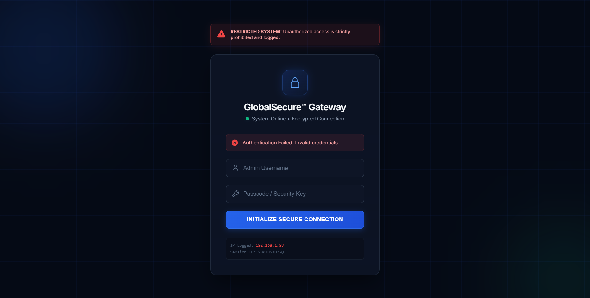
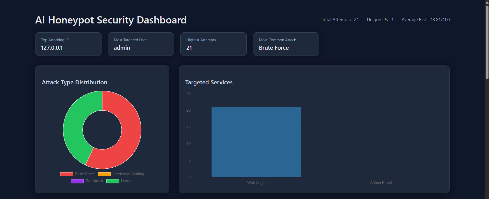
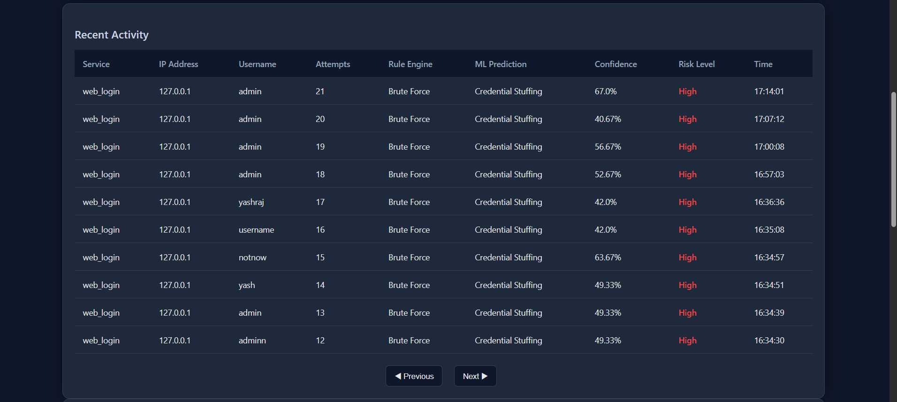
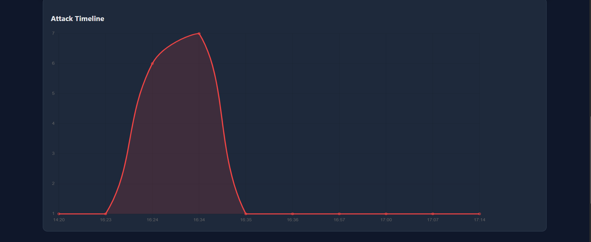
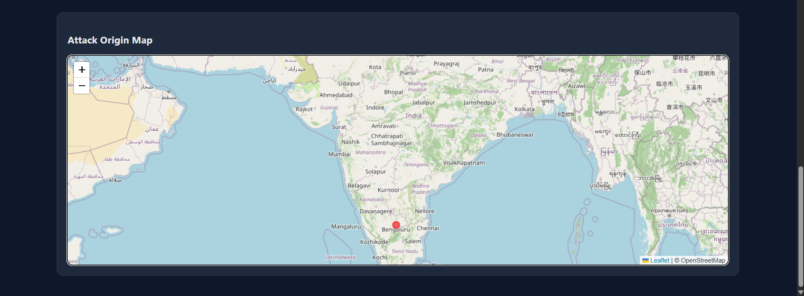

# 🛡️ AI Honeypot Security Operations Center (SOC)

An AI-powered Honeypot Security Operations Center built using **Flask**, **MongoDB Atlas**, and **Machine Learning**. The project simulates a vulnerable login system that captures malicious login attempts, analyzes attacker behavior using both **rule-based detection** and a **Random Forest Machine Learning model**, and visualizes security events through an interactive SOC dashboard.

---

## 📌 Project Overview

Traditional login systems simply reject invalid login attempts. This project goes a step further by acting as a **honeypot**, intentionally logging attacker activity instead of ignoring it.

Every login attempt is analyzed using:

- Rule-based Attack Detection
- Machine Learning Prediction
- Risk Score Generation
- Geolocation Tracking
- Interactive SOC Dashboard

The system helps security analysts understand attacker behavior in real time.

---

# ✨ Features

### 🔐 Honeypot Login System

- Fake Login Page
- Fake Admin Panel
- Captures Invalid Login Attempts
- Stores Username & Password
- Logs Client IP Address
- Logs Browser User-Agent

---

### 🧠 Machine Learning

- Random Forest Classifier
- Attack Prediction
- Prediction Confidence
- Risk Score Generation
- Hybrid Rule + ML Detection

---

### 📊 Interactive Dashboard

- Total Attack Counter
- Unique IP Counter
- Attack Distribution Chart
- Targeted Services Chart
- Attack Timeline
- Recent Activity Table
- ML Prediction Column
- Confidence Score
- Risk Level
- Auto Refresh

---

### 🌍 Threat Intelligence

- IP Geolocation
- Country Detection
- City Detection
- Attack Origin Map (works with public IPs)

---

### ⚙ Backend Features

- Flask Web Framework
- MongoDB Atlas Database
- REST API (`/api/logs`)
- Health Check Endpoint (`/health`)
- Modular Project Architecture

---

# 🛠 Tech Stack

| Category | Technology |
|----------|------------|
| Language | Python |
| Backend | Flask |
| Database | MongoDB Atlas |
| Machine Learning | Scikit-learn (Random Forest) |
| Frontend | HTML, CSS, JavaScript |
| Charts | Chart.js |
| Maps | Leaflet.js |
| Version Control | Git & GitHub |

---

# 📂 Project Structure

```text
AI_Honeypot_Project
│
├── ml/
│   ├── model.pkl
│   ├── predictor.py
│   ├── train_model.py
│   ├── generate_dataset.py
│   ├── training_data.csv
│   └── encoders/
│
├── static/
│
├── templates/
│   ├── dashboard.html
│   └── login.html
│
├── app.py
├── ai_engine.py
├── database.py
├── config.py
├── utils.py
│
├── requirements.txt
├── Procfile
├── README.md
└── .env.example
```

---

# 🚀 Installation

Clone the repository

```bash
git clone https://github.com/YOUR_USERNAME/AI-Honeypot-SOC.git

cd AI-Honeypot-SOC
```

Install dependencies

```bash
pip install -r requirements.txt
```

Create a `.env` file

```env
MONGO_URI=your_mongodb_connection_string
SECRET_KEY=your_secret_key
```

Run the application

```bash
python app.py
```

Open

```
http://127.0.0.1:5000
```

---

# 📡 API Endpoints

| Endpoint | Description |
|----------|-------------|
| `/` | Login Honeypot |
| `/admin` | Fake Admin Panel |
| `/dashboard` | SOC Dashboard |
| `/api/logs` | Latest Attack Logs |
| `/health` | Health Check |

---

# 🧠 Machine Learning Workflow

1. Login Attempt Captured
2. Rule Engine Classification
3. Feature Extraction
4. Random Forest Prediction
5. Confidence Calculation
6. Risk Score Generation
7. Store in MongoDB
8. Display on SOC Dashboard

---

# 📸 Screenshots

## Login Page



## Dashboard



## Recent Activity




## Attack Timeline




## Attack Origin Map




# 🔮 Future Improvements

- Email Alerts
- Real-Time WebSocket Dashboard
- SIEM Integration
- Threat Intelligence APIs
- Docker Deployment
- User Authentication
- Multiple Honeypot Services (SSH, FTP, HTTP)

---

# 👨‍💻 Author

**Yashraj Jangir**

Final Year B.Tech (Computer Science Engineering & Cyber Security)

---

# 📄 License

This project is intended for educational and research purposes.
